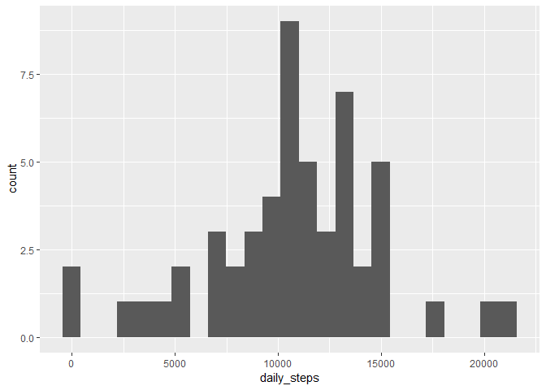
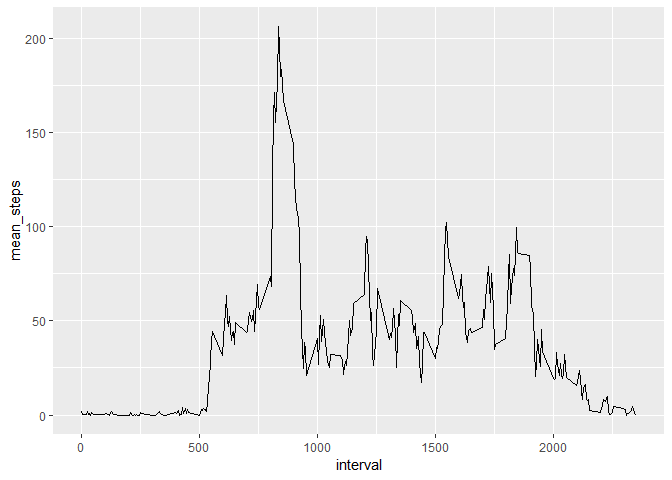
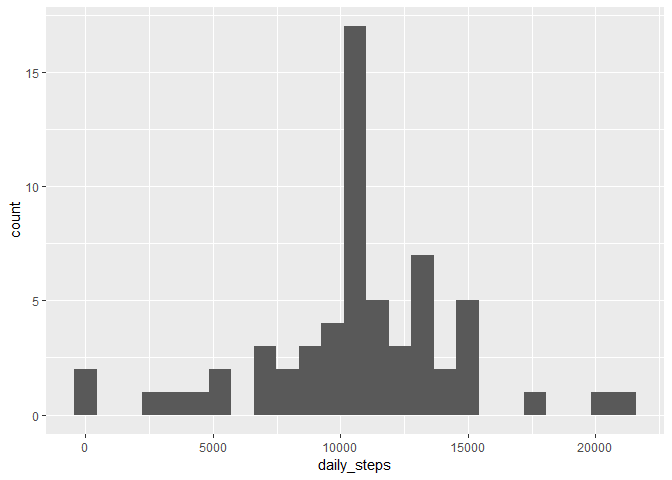
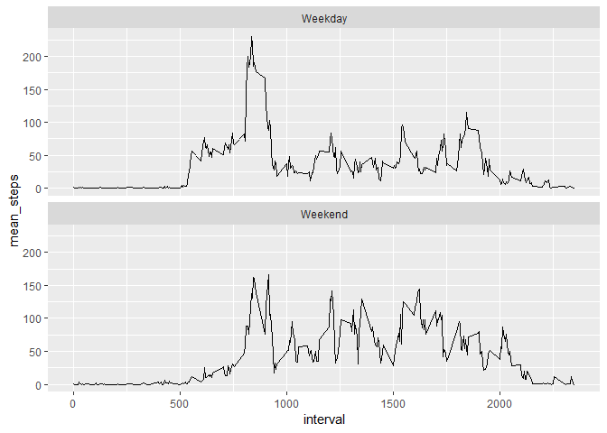

## Loading and preprocessing the data

First the activity file will need to be read in.  A summary of the resulting dataframe 
may be helpful in understanding the data.


```r
file_name <- unzip("activity.zip", files = "activity.csv")
activity <- read.csv(file_name)
str(activity)
```

```
## 'data.frame':	17568 obs. of  3 variables:
##  $ steps   : int  NA NA NA NA NA NA NA NA NA NA ...
##  $ date    : Factor w/ 61 levels "2012-10-01","2012-10-02",..: 1 1 1 1 1 1 1 1 1 1 ...
##  $ interval: int  0 5 10 15 20 25 30 35 40 45 ...
```

```r
summary(activity)
```

```
##      steps                date          interval     
##  Min.   :  0.00   2012-10-01:  288   Min.   :   0.0  
##  1st Qu.:  0.00   2012-10-02:  288   1st Qu.: 588.8  
##  Median :  0.00   2012-10-03:  288   Median :1177.5  
##  Mean   : 37.38   2012-10-04:  288   Mean   :1177.5  
##  3rd Qu.: 12.00   2012-10-05:  288   3rd Qu.:1766.2  
##  Max.   :806.00   2012-10-06:  288   Max.   :2355.0  
##  NA's   :2304     (Other)   :15840
```

It might be helpful to add a time column to the data frame that contains the hours,
minutes, and seconds in a familiar format.  You may need to install the **stringr**,
**lubridate**, or **chron** packages first.


```r
library(stringr)
library(lubridate)
library(chron)
```


```r
activity$time <- str_pad(activity$interval, 4, pad = "0")
activity$time <- times(paste( substr(activity$time, start = 1, stop = 2), 
                               substr(activity$time, start = 3, stop = 4), 
                               "00", sep = ":"))
```

## What is mean total number of steps taken per day?

In order to get the mean total number of steps taken per day it may be easier to 
manipulate the **activity** data frame from earlier.  I prefer to do this with
the **dplyr** package.


```r
library(dplyr)
```


```r
daily_activity <- activity %>% group_by(date) %>% summarize(daily_steps = sum(steps)) %>%
    filter(!is.na(daily_steps))
```

It may be helpful to visualize this new data frame with a histogram.  I prefer to
use **ggplot2** to create graphs and visualizations.


```r
library(ggplot2)
ggplot(daily_activity, aes(x = daily_steps)) + geom_histogram(bins = 25)
```

<!-- -->

It looks like the peak is just above 10,000 steps.  We specifically calculate the
mean and median to check against the above graph.

### Mean ###


```r
mean_daily_steps <- mean(daily_activity$daily_steps)
mean_daily_steps
```

```
## [1] 10766.19
```

### Median ###


```r
median_daily_steps <- median(daily_activity$daily_steps)
median_daily_steps
```

```
## [1] 10765
```

Both the median and mean are just over 10,000.

## What is the average daily activity pattern?

Using similar techniques to those above we can begin analyzing the data by time interval.


```r
interval_activity <- activity %>% group_by(interval, time) %>% summarize(mean_steps = mean(steps, na.rm = TRUE))
```

Again, a graph may be helpful to understand the dataset.


```r
ggplot(interval_activity, aes(x = interval, y = mean_steps)) + geom_line()
```

<!-- -->

It looks like the max value is just under the *1000* interval.  We can find the 
max value and validate this.


```r
max_interval <- interval_activity[which.max(interval_activity$mean_steps),1:2]
max_interval
```

```
## # A tibble: 1 x 2
## # Groups:   interval [1]
##   interval time       
##      <int> <S3: times>
## 1      835 08:35:00
```

It looks like the max value appears around 8:35AM, which makes sense looking at the graph.

## Imputing missing values

The activity data frame contains several missing values.  It would be good to know
how many missing values there are.


```r
missing_values <- sum(is.na(activity$steps))
missing_values
```

```
## [1] 2304
```

A good technique to use when imputing missing values is to fill it with an average. 
In this case we fill replace the NA value with the mean for that 5 minute interval.
We'll check to see how many missing values there are after.


```r
for(i in 1:nrow(activity)){
    if(is.na(activity[i,1])){
       activity[i,1] <- interval_activity[match(activity[i,4],interval_activity$time),3]
    }
}
missing_values <- sum(is.na(activity$steps))
missing_values
```

```
## [1] 0
```

It appears that there are no longer missing values.

Now we will make a similar graph to the first step.  First, we must remake the 
dataset We will also calculate the mean and median.


```r
daily_activity <- activity %>% group_by(date) %>% summarize(daily_steps = sum(steps))
ggplot(daily_activity, aes(x = daily_steps)) + geom_histogram(bins = 25)
```

<!-- -->


```r
mean_daily_steps <- mean(daily_activity$daily_steps)
mean_daily_steps
```

```
## [1] 10766.19
```


```r
median_daily_steps <- median(daily_activity$daily_steps)
median_daily_steps
```

```
## [1] 10766.19
```

The NA values appear to be for specific days, so by forcing missing values to the mean for the interval it forces missing days to have means equal to the mean for daily steps.  This also coerces the median to the mean as the missing days will now be counted as equal to the mean.  The large middle bar in the histogram above is the number of days that were missing, that are now the mean daily value of steps.

## Are there differences in activity patterns between weekdays and weekends?

First, we will need to add a new variable to the activity data frame that specifies whether the day is a weekday or weekend.


```r
weekdays <- c("Monday","Tuesday","Wednesday","Thursday","Friday")
activity <- activity %>% mutate(weekday = ifelse(weekdays(ymd(activity$date)) %in% weekdays, "Weekday", "Weekend"))
```

Now we can compare the steps per time interval on weekdays vs weekends.


```r
interval_activity <- activity %>% group_by(interval, time, weekday) %>% summarize(mean_steps = mean(steps, na.rm = TRUE))
interval_activity$weekday <- as.factor(interval_activity$weekday)

ggplot(interval_activity, aes(x = interval, y = mean_steps)) + geom_line() + facet_wrap(interval_activity$weekday, nrow = 2)
```

<!-- -->

It looks like there is definitely a difference in activity during weekends vs weekdays.
